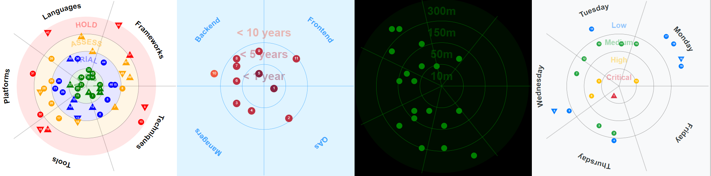

# EG-Radar



eg-radar is a JavaScript library for creating interactive radars inspired by [Thoughtworks](https://www.thoughtworks.com/radar) and [Zalando Tech Radar](https://opensource.zalando.com/tech-radar/) technology radars. It provides many customization options to create radar that fits your needs and style preferences. You can look at [demo technology radar](https://eg-radar-demo.stackblitz.io/) built with eg-radar.


## Installation
Tech radar module can simply be installed using npm:
```sh
$ npm install eg-radar
```

## Usage
To use the module you need to import it in your project:
```javascript
import { EgRadar } from 'eg-radar';
```
Then, create a radar configuration object and pass it to the radar constructor:
```javascript
var radarConfig = {
    width: 700,
    sectors = [
        { "label": "Techniques"              },
        { "label": "Tools"                   },
        { "label": "Platforms"               },
        { "label": "Languages & Frameworks"  },
    ],
    rings = [
        { "label": "ADOPT" , "color": "green" },
        { "label": "TRIAL" , "color": "blue"  },
        { "label": "ASSESS", "color": "orange"},
        { "label": "HOLD"  , "color": "red"   }
    ],
    entries = [
         { "label": "Java",   "sector": 3, "ring": 1, "moved": 0 },
         { "label": "Angular","sector": 3, "ring": 2, "moved": 1 },
         { "label": "React",  "sector": 3, "ring": 2, "moved": -1},
         { "label": "AWS",    "sector": 2, "ring": 0, "moved": 0 }
    ],
    style: {
      showSectorLabels: true
    }
};

let radar = new EgRadar(radarConfig);
```

Finally to render the radar create `<svg>` element and pass element id to the render function:

```html
<svg id="myRadar"></svg>
```
```javascript
radar.render("myRadar")
```

## Radar Configuration
Radar configuration object has following properties:
| Property         | Type   | Description                                         |
| ---------------- | ------ | --------------------------------------------------- |
| width            | number | Width and Height of the radar                       |
| sectors          | array  | Array of sector configurations                      |
| sectors[].label  | string | Sector label                                        |
| sectors[].data   | any    | Custom sector data                                  |
| rings            | array  | Array of ring configurations objects                |
| rings[].label    | string | Ring label                                          |
| rings[].color    | string | Ring color                                          |
| entries          | array  | List of entries to display in radar                 |
| entries[].label  | string | Data label                                          |
| entries[].sector | number | Sector index                                        |
| entries[].ring   | number | Ring index                                          |
| entries[].moved  | number | Movement direction (1 - up, -1 down, 0 - no change) |
| entries[].data   | any    | Custom data for your needs                          |

## Callbacks
Radar configuration object has following callback properties:
| Property   | Type            | Description                                    |
| ---------- | --------------- | ---------------------------------------------- |
| onSelect   | function(entry) | Callback function called when entry is clicked |
| onHover    | function(entry) | Callback function called when entry is hovered |
| onHoverOut | function(entry) | Callback function called when hover has ended  |

## Style
Radar configuration object has following style properties:
| Property                     | Type    | Default                 | Description                                                                                    |
| ---------------------------- | ------- | ----------------------- | ---------------------------------------------------------------------------------------------- |
| style.seed                   | number  | Random value            | Seed for random number generator to have consistant generations, leave empty for random result |
| style.background             | string  | Transparent (#00000000) | Radar background color                                                                         |
| style.lineColor              | string  | gray                    | Radar line color                                                                               |
| style.font                   | string  | Arial, Helvetica        | Text font used across radar                                                                    |
| style.blips                  | object  |                         | Blip style configuration                                                                       |
| style.blips.r                | number  | 12                      | Blip radius                                                                                    |
| style.blips.offset           | number  | 15                      | Spacing between blips. Ignored if all blips cannot be spread out                               |
| style.blips.textColor        | string  | white                   | Blip text color                                                                                |
| style.blips.fontSize         | number  | 12                      | Blip text font size                                                                            |
| style.rings                  | object  |                         | Ring style configuration                                                                       |
| style.rings.showLabels       | boolean | true                    | Show ring labels                                                                               |
| style.rings.fontSize         | number  | 30                      | Ring text font size                                                                            |
| style.rings.showBackground   | boolean | false                   | If enabled fills ring's background                                                             |
| style.rings.showCurvedLabels | boolean | true                    | Renders ring label in arc. Long text may not be rendered                                       |
| style.sectors                | object  |                         | Sector style configuration                                                                     |
| style.sectors.showLabels     | boolean | true                    | Show sector labels                                                                             |
| style.sectors.highlight      | boolean | true                    | Highlight sector on entry selection                                                            |
| style.sectors.fontSize       | number  | 30                      | Sector text font size                                                                          |
| style.sectors.textColor      | string  | black                   | Sector text color                                                                              |
| style.tooltip                | object  |                         | Tooltip style configuration                                                                    |
| style.tooltip.textColor      | string  | white                   | Tooltip text color                                                                             |
| style.tooltip.enabled        | boolean | true                    | Enable tooltip on hover                                                                        |
| style.tooltip.background     | string  | black                   | Tooltip background color                                                                       |
| style.tooltip.fontSize       | number  | 15                      | Tooltip text font size                                                                         |

### Contributions

Contributions are welcome. Please read [CONTRIBUTING.md](https://github.com/EdgarsGarsneks/eg-radar/blob/main/CONTRIBUTING.md) for more information. <br><br>

Special thanks to all the people who have already contributed to this project! 
<a href="https://github.com/EdgarsGarsneks/eg-radar/graphs/contributors">
  
</a>